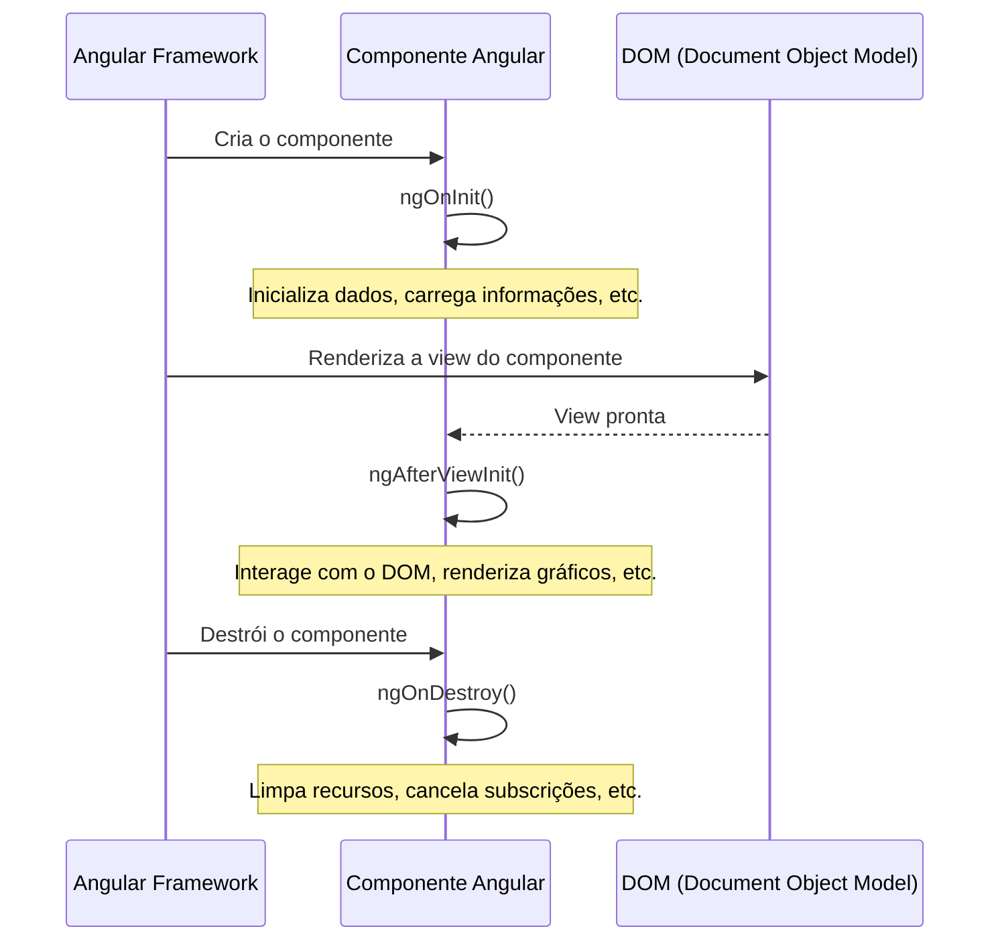



No Angular, o ciclo de vida de um componente é uma série de eventos que ocorrem desde a criação até a destruição de um componente. Esses eventos permitem que os desenvolvedores executem lógicas específicas em momentos cruciais do ciclo de vida do componente. No Angular 15, três dos principais eventos do ciclo de vida são: `OnInit`, `OnAfterViewInit` e `OnDestroy`. Vamos explorar cada um deles com exemplos práticos.

---

### 1. **OnInit**

O evento `OnInit` é disparado quando o componente é inicializado. Ele é chamado uma vez, logo após o Angular terminar de configurar o componente e suas propriedades de entrada (`@Input`). Esse é o momento ideal para realizar inicializações, como carregar dados de uma API ou configurar valores iniciais.

#### Exemplo:

Suponha que temos um componente `UserProfileComponent` que exibe informações de um usuário. Essas informações são carregadas de uma API quando o componente é inicializado.

```typescript
import { Component, OnInit } from '@angular/core';
import { UserService } from './user.service';

@Component({
  selector: 'app-user-profile',
  template: `<div>{{ user.name }}</div>`
})
export class UserProfileComponent implements OnInit {
  user: any;

  constructor(private userService: UserService) {}

  ngOnInit(): void {
    this.userService.getUser().subscribe(data => {
      this.user = data;
    });
  }
}
```

Neste exemplo, o método `ngOnInit` é usado para carregar os dados do usuário assim que o componente é inicializado. Isso garante que a lógica de carregamento seja executada no momento certo.

---

### 2. **OnAfterViewInit**

O evento `OnAfterViewInit` é disparado após o Angular inicializar a view do componente e suas views filhas. Esse é o momento ideal para interagir com o DOM ou realizar operações que dependem da renderização completa do template.

#### Exemplo:

Imagine um componente `ChartComponent` que renderiza um gráfico usando uma biblioteca de terceiros que precisa acessar um elemento do DOM.

```typescript
import { Component, AfterViewInit, ViewChild, ElementRef } from '@angular/core';
import * as Chart from 'chart.js';

@Component({
  selector: 'app-chart',
  template: `<canvas #chartCanvas></canvas>`
})
export class ChartComponent implements AfterViewInit {
  @ViewChild('chartCanvas') chartCanvas!: ElementRef;

  ngAfterViewInit(): void {
    const ctx = this.chartCanvas.nativeElement.getContext('2d');
    new Chart(ctx, {
      type: 'bar',
      data: {
        labels: ['Red', 'Blue', 'Yellow'],
        datasets: [{
          label: 'Votes',
          data: [12, 19, 3],
          backgroundColor: ['red', 'blue', 'yellow']
        }]
      }
    });
  }
}
```

Aqui, o método `ngAfterViewInit` é usado para garantir que o gráfico seja renderizado apenas após o elemento `<canvas>` estar disponível no DOM.

---

### 3. **OnDestroy**

O evento `OnDestroy` é disparado quando o componente é destruído, ou seja, quando ele é removido do DOM. Esse é o momento ideal para realizar limpezas, como cancelar subscrições de observables ou liberar recursos para evitar memory leaks.

#### Exemplo:

Suponha que temos um componente `NotificationComponent` que se inscreve em um serviço de notificações para exibir alertas em tempo real. Quando o componente é destruído, precisamos cancelar a subscrição para evitar vazamentos de memória.

```typescript
import { Component, OnInit, OnDestroy } from '@angular/core';
import { NotificationService } from './notification.service';
import { Subscription } from 'rxjs';

@Component({
  selector: 'app-notification',
  template: `<div>{{ message }}</div>`
})
export class NotificationComponent implements OnInit, OnDestroy {
  message: string = '';
  private subscription!: Subscription;

  constructor(private notificationService: NotificationService) {}

  ngOnInit(): void {
    this.subscription = this.notificationService.getNotifications().subscribe(message => {
      this.message = message;
    });
  }

  ngOnDestroy(): void {
    this.subscription.unsubscribe();
  }
}
```

Neste exemplo, o método `ngOnDestroy` é usado para cancelar a subscrição do observable, garantindo que nenhuma lógica desnecessária continue sendo executada após o componente ser destruído.

---

### Situação Prática: Resolvendo um Problema com `ngAfterViewInit`

#### Problema:
Imagine um componente `ModalComponent` que exibe um modal na tela. O modal precisa ser focado automaticamente quando é aberto para garantir a acessibilidade. No entanto, o foco só pode ser aplicado após o modal ser renderizado no DOM.

#### Solução:
Podemos usar o `ngAfterViewInit` para garantir que o foco seja aplicado apenas após o modal estar completamente renderizado.

```typescript
import { Component, AfterViewInit, ViewChild, ElementRef } from '@angular/core';

@Component({
  selector: 'app-modal',
  template: `
    <div #modal class="modal">
      <div class="modal-content">
        <p>Este é um modal!</p>
      </div>
    </div>
  `
})
export class ModalComponent implements AfterViewInit {
  @ViewChild('modal') modal!: ElementRef;

  ngAfterViewInit(): void {
    this.modal.nativeElement.focus();
  }
}
```

Neste caso, o método `ngAfterViewInit` resolve o problema de acessibilidade, garantindo que o modal receba o foco no momento certo.

### Diagrama





### Conclusão

Os eventos do ciclo de vida de um componente no Angular 15, como `OnInit`, `OnAfterViewInit` e `OnDestroy`, são ferramentas poderosas para gerenciar a lógica de um componente de forma eficiente. Cada evento tem um propósito específico e, quando usado corretamente, pode resolver problemas comuns, como carregamento de dados, interação com o DOM e gerenciamento de recursos. Entender e aplicar esses eventos é essencial para desenvolver componentes robustos e de alta performance.


